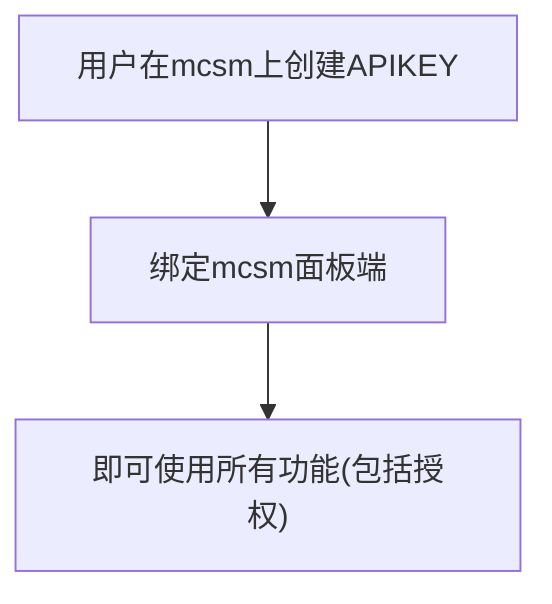
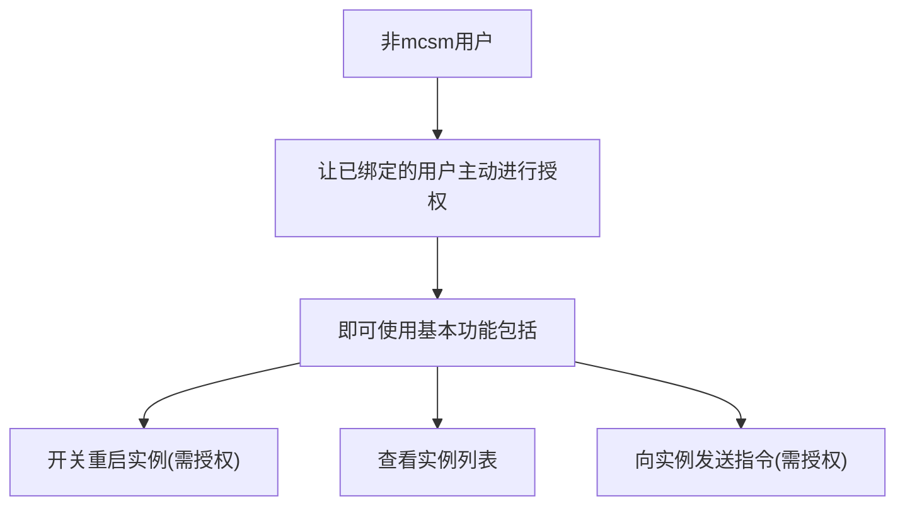

# nonebot-plugin-mcsmanager

摸

还没写完

## 工作思路

### mcsm已有用户

```mermaid
flowchart TD
    用户在mcsm上创建APIKEY
        --> 绑定mcsm面板端
        --> d["即可使用所有功能(包括授权)"]
```

### 授权个人

```mermaid
flowchart TD
    非mcsm用户
        --> 让已绑定的用户主动进行授权
        --> a[即可使用基本功能包括]
    a --> b["开关重启实例(需授权)"]
    a --> c[查看实例列表]
    a --> d["向实例发送指令(需授权)"]
```

## 绑定