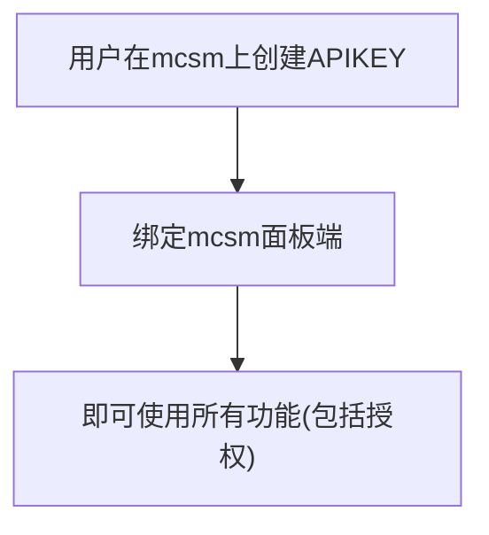
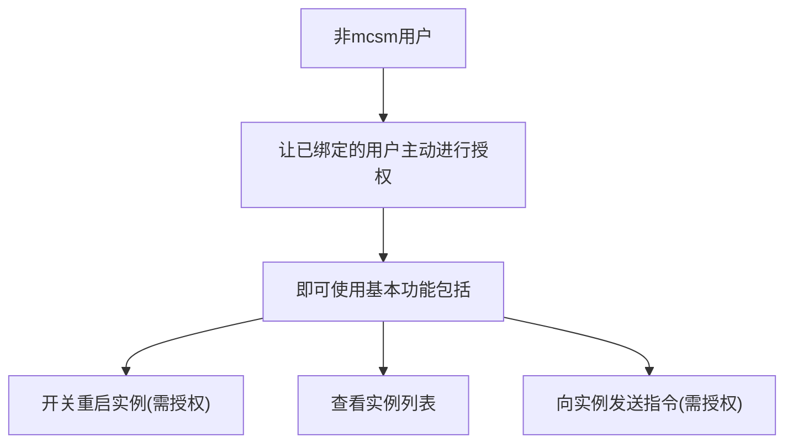

# nonebot-plugin-mcsmanager

摸

还没写完

## 工作思路

### mcsm已有用户

### 授权个人

## 基本指令

使用 `mcsm --help` 查询，相关指令也可以用类似的方法，例如 `mcsm admin --help` 等

## 绑定

- 超级管理员使用 `mcsm bind [url] [apikey] [userid]` 来绑定某人/自己为实例管理
  - 需要自行获取 mcsm 的 apikey
  - userid 为该平台的指定用户ID，例如QQ号，可以填写自己或别人的
- 绑定完成后，使用 `mcsm admin add_user [name] [remote_uuid] [instance_uuid] [userid]`
  - name 为自己起的名字，方便区分以及后续使用开关指令
  - remote_uuid 为节点ID 可在实例页面中复制
  - instance_uuid 为实例ID 可在实例页面中复制
  - userid 为该平台的指定用户ID，例如QQ号，可以填写自己或别人的
  - 实例管理也需要绑定这些信息

## 解绑用户绑定

~~还没做~~

## 获取服务器信息

~~还没做~~

## 开关服务器

- `mcsm on [name]`
  - name 之前起的名字
  - name 可选，可以不写直接 `mcsm on` 会打印列表供选择，根据提示回复即可
- `mcsm off/restart` 等同上

## 向服务器发送指令

~~还没做~~

## TODO

- [ ] 修改架构，使其可以直接接管mcsm的普通用户所有实例
- [ ] 完善功能
